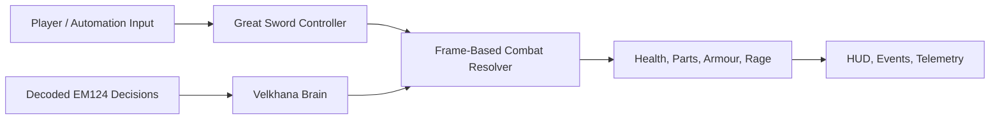

# Velkhana Slice

A reference-driven **Unity combat systems study inspired by *Monster Hunter World: Iceborne***. It rebuilds a focused Great Sword versus Velkhana encounter as a deterministic, playable graybox.

The project explores how Iceborne-inspired state-machine and monster-behavior data can be translated into readable, testable gameplay code without depending on final character art or animation assets.

## Highlights

- **Velkhana combat AI** — range, facing, combat-mode and enraged selectors traced to EM124 THK nodes, including aerial dispatch, action sequences, interrupts and repositioning.
- **Great Sword state machine** — charge tiers, tackle shortcuts, True Charged Slash routing, draw/sheathe transitions, guard and evade behavior derived from the WP00 action graph.
- **Frame-authoritative combat** — fixed 60 Hz simulation, data-driven startup/active/recovery windows, hit volumes, part damage, ice armour, staggers and topples.
- **Debugging tools** — live player/monster state panels, THK traces, attack timelines, spacing intent and combat-volume visualization.
- **Deterministic automation** — loopback HTTP API for exact frame stepping, input, seeded resets, snapshots, event telemetry and camera capture.

## Run it

1. Open the repository with **Unity 6000.4.11f1**.
2. Select **Velkhana → Rebuild Graybox Scene**.
3. Open `Assets/Scenes/Graybox.unity` and enter Play Mode.

Use **WASD** to move, mouse to aim, left/right mouse for primary/secondary attacks, **Space** to evade, **R** to guard, and **Shift** to run. Press **F2** for the state debugger and **F3** for combat volumes.

## Validation

The latest merged revision passes:

- **120 EditMode tests** covering combat math, decoded selectors and transition boundaries.
- **52 PlayMode tests** covering real fixed-frame attacks, combos, AI sequences, rage, aerial behavior, repositioning and scene wiring.

See [SETUP.md](SETUP.md) for implementation details and [AUTOMATION.md](AUTOMATION.md) for the deterministic gameplay API.

## Scope

This is an unofficial, non-commercial technical study and is not affiliated with or endorsed by Capcom. The playable scene uses project-authored procedural graybox presentation; *Monster Hunter*, Velkhana and related properties belong to Capcom.
